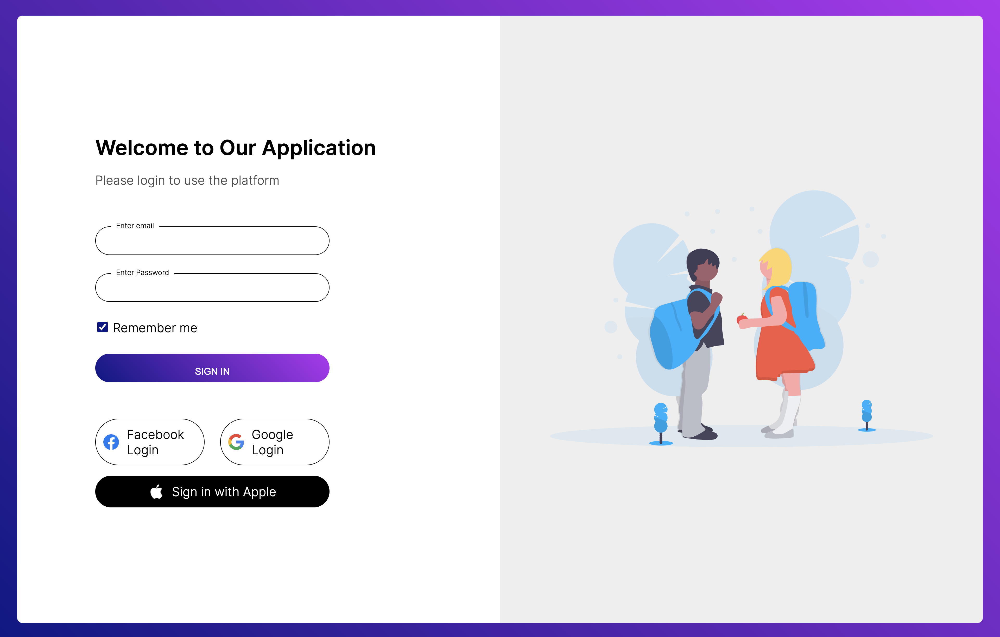

# Page de Login HTML/CSS

Ce projet est une simple page de connexion statique créée dans le cadre d'un exercice lors de ma formation Développeur Web et Web Mobile. L'objectif était de pratiquer mes compétences en HTML et CSS en concevant une interface utilisateur basique pour un formulaire de connexion.

## Aperçu



## Technologies utilisées

- HTML
- CSS

## Instructions d'utilisation

1. Clonez ce référentiel sur votre machine locale.
   ```bash
   git clone https://github.com/Thomas-Martins/login-page-html-css-.git
